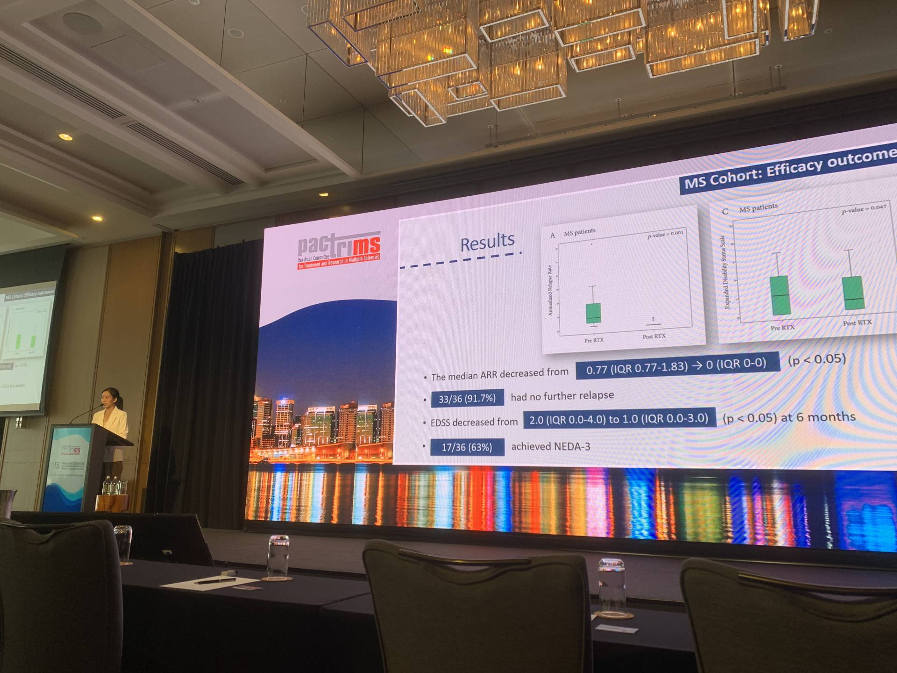

## Oral Presentations

**Efficacy and Safety of Extended Interval Rituximab in Multiple Sclerosis and Neuromyelitis Optica Spectrum Disorder**, presented at the 13th Pan-Asian Committee for Treatment and Research in Multiple Sclerosis (2023), Perth, Australia.

----

## Abstract Presentations

|Topic                             |Meeting               |Year|Place|
|----------------------------------|----------------------|----|-----|
|Vaccination Coverage in Patients with Idiopathic Inflammatory Central Nervous System Demyelinating Diseases at Siriraj hospital, a Single-center Experience|The 12th Pan-Asian Committee for Treatment and Research in Multiple Sclerosis|2022|Singapore|
|The Utility of Neurofilament Light Chain in Aetiologic Differentiation of Disorders of Consciousness|The XXVI World Congress of Neurology|2023|Montreal, Canada|
|Tumefactive Demyelinating Lesions: A Retrospective Cohort Study in Thailand|The 39th Congress of the European Committee for Treatment and Research in Multiple Sclerosis - the American Committee for Treatment and Research in Multiple Sclerosis|2023|Milan, Italy|

----

## Invited Lectures

|Topic                                        |             Meeting         |   Year    |Place|
|----------------------------------------------|-------------------------------|----------|----|
|Neurofilament Light Chain and Its Application in MS|The 4th MS Preceptorship|February 2023|Mahidol University Siriraj Hospital|
|CNS Inflammatory Demyelinating Diseases: Practical Overview for Internists|The Annual Conference in Medicine|July 2023|Surat Thani Hospital, Thailand|
|Natalizumab|The 5th MS Preceptorship|December 2024|Mahidol University Siriraj Hospital|
|Teriflunomide|The 5th MS Preceptorship|December 2024|Mahidol University Siriraj Hospital|
|Approach to Atypical Myelopathies|The 13th Siriraj Neuroscience Annual Conference|January 2024|Mahidol University Siriraj Hospital|
|Dimethyl Fumarate|The 3rd MS on Tour|February 2024|Ubon Ratchathani, Thailand|
